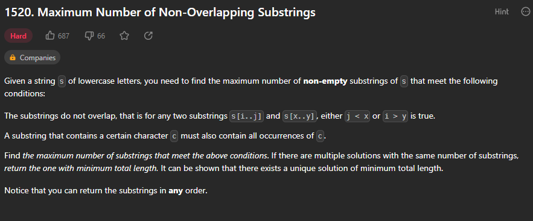
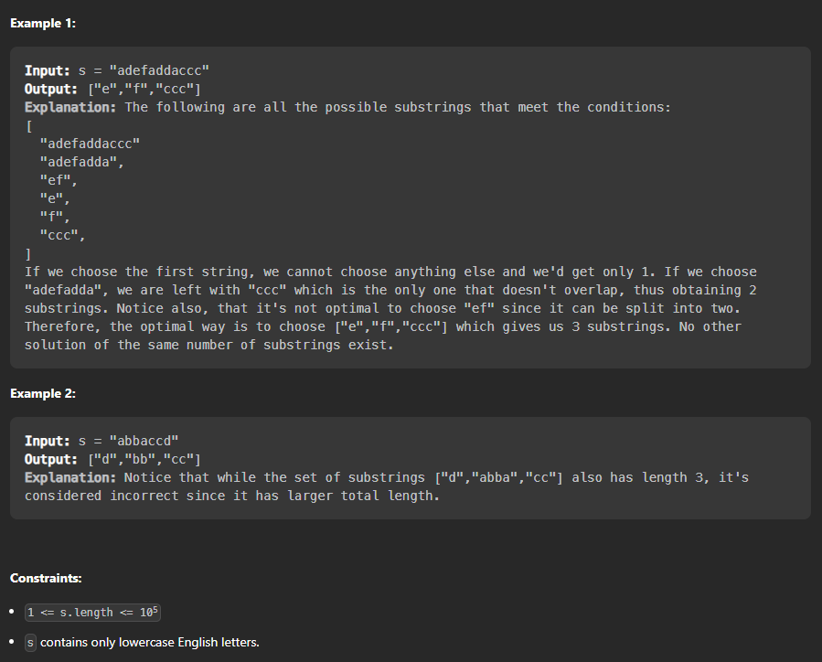

# Página de acesso ao exercício
[Maximum Number of Non-Overlapping Substrings](https://leetcode.com/problems/maximum-number-of-non-overlapping-substrings/description/) 
# Explicação

# Exemplos e Restrições

